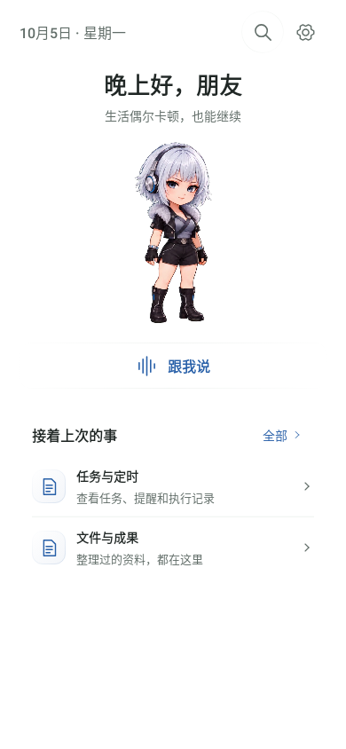
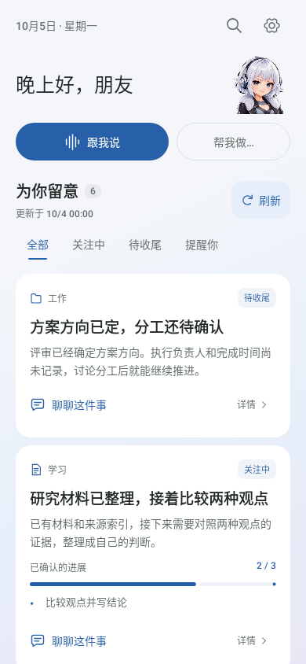

# Hermes Android

把自己的 Hermes Agent 带到手机上。随时聊天、接着处理工作、查看文件，也可以让首页帮你留意待办和近期进展。

**当前版本：3.8.8 · Android 8.0 及以上**

[下载安装包](https://github.com/jeromeleeqy-hash/Hermes-Android/releases/tag/v3.8.8) · [快速开始](docs/QUICK-START.md) · [English](docs/QUICK-START-EN.md) · [本版更新](docs/RELEASE-3.8.8.md) · [文档中心](docs/README.md)

Hermes Android 是个人自部署 Hermes Agent 的原生安卓客户端，需要连接你已有的 Hermes 远程网关。模型、Skills、工具、记忆和任务继续运行在自己的服务器上，手机端负责交互；深度助理使用现有工作区里的 JSON 和 Markdown，不需要额外的数据库或服务。

## 选一种适合你的首页

| 简洁首页 | 深度助理 |
| --- | --- |
|  |  |
| 打开就能聊，保留人物、问候和最近对话。适合把 App 当作通用 Hermes 移动终端。 | 汇总关注中的事项、待收尾工作和提醒，可从卡片继续讨论，按需设置早晚整理。 |
| **新用户默认使用，无需配置整理功能。** | **自愿开启，首页设置会引导首次配置。** |

以上为界面渲染示例，卡片内容不是用户的真实资料。

点击首页右上角 **齿轮 → 首页模式** 即可切换，App 会记住选择。两种模式都能聊天、管理任务、处理授权和查看文件。切回简洁首页会停止首页内容的被动读取，但已配置的服务器定时任务仍会运行；需要暂停时到“任务”操作。

## 日常能做什么

| 入口 | 常用功能 |
| --- | --- |
| **助理** | “跟我说”继续固定日常对话；“帮我做”带着具体需求开始协作；深度模式展示事项和进展。 |
| **回看** | 查找和继续对话，按项目筛选，手动重命名、置顶或归档。 |
| **任务** | 查看执行进度、处理授权和澄清、管理定时安排与执行记录。 |
| **文件** | 浏览服务器工作区，预览图片、Markdown、PDF 等文件，编辑文本、下载或分享。 |
| **我的** | 管理连接、Profile、语音、模型、Skills、外观、语言与软件更新。 |

- 支持流式聊天、断线恢复、多个会话同时执行；返回列表后，已开始的回复继续生成。
- 可以把手机上的文字、链接、图片和文件分享给 Hermes，也可以在对话里选择工作区文件。
- 支持单次语音输入、连续语音、回答复制和朗读；具体语音能力取决于手机或服务器配置。
- 提供温暖灵动、液态玻璃、安静耐看三套外观，支持浅色、深色、跟随系统和减少动态效果。
- 自动整理等 App 任务在手机“任务”页查看，不挤占普通会话列表。服务器与 PC 上的记录仍然保留。

## 安装与首次连接

1. 安装 **`Hermes-Android-3.8.8-release.apk`**。已有相同包名、相同签名的版本可直接覆盖安装，保留本机配置。
2. 按欢迎页设置昵称与头像，进入网关连接页。
3. 填入电脑端使用的 **完整远程 URL、Hermes 用户名和密码**。例如 `https://hermes.example.com`；不要额外加 `/api` 或 `/v1`，已有反向代理路径前缀则保留。
4. 连接后即可使用简洁首页。希望使用事项卡片时，再从齿轮切换到深度助理。

App 不保存登录密码，登录 Cookie 由 Android Keystore 加密保存在本机。网关连接方法见 [远程网关接入](docs/SERVER_SETUP.md)。已有用户可在 **我的 → 设置 → 软件更新** 检查维护者发布的安装包。

交付包沿用 `com.qingyu.hermescompanion.preview`。自行签名的构建不能覆盖不同签名的安装包；仓库不包含发布私钥。

## 深度助理需要配置什么

所有入口集中在 **首页右上角齿轮**，只启用自己需要的功能。

| 配置 | 什么时候需要 |
| --- | --- |
| 首次整理 | 第一次使用事项首页时运行一次；已有首页内容后不重复显示按钮。 |
| 早晚整理 | 可选。设置时间与时区后持续按服务器计划运行，之后只在调整安排时修改。 |
| 文件收纳 | 仅旧版首页文件需要迁移一次；新用户自动建立目录，已收纳则显示完成说明。 |

首页文件集中在工作区的 `.hermes-app/today/`；原业务文件留在原处。在卡片对话中完成一轮处理后，App 会核对该事项的最新进展并自动更新首页。只有实际保存的进展才会改变状态，普通讨论不会自动算作完成。已有用户不需要为 3.8.8 重做首页或早晚配置。

## 最近更新

- **3.8.8：** 深度助理右上角换为头胸部人物，6 段动作自然轮播，点按眨眼回应；离屏或后台停止，减少动态效果时显示静态形象。
- **3.8.7：** 卡片处理后自动同步首页，事项聊天更自然，回看页改为手动重命名，并简化首页信息区。
- **3.8.6：** 简洁首页和深度助理随时切换，保留三套外观及已有配置。

[完整中文更新日志](CHANGELOG.md) · [English release history](CHANGELOG.en.md) · [历史发布说明](docs/archive/release-notes/README.md)

## 开发与构建

使用 **JDK 21、Android SDK / Build Tools 36**。工程固定使用 Gradle 8.13、AGP 8.13.2、Kotlin 2.3.20 和 Jetpack Compose；JVM 目标为 Java 17。用 Android Studio 打开根目录，完成 Gradle Sync 后运行 `app`。

```bash
./gradlew testDebugUnitTest lintRelease assembleDebug
python3 -m unittest discover -s tests -v
```

Release 构建、签名参数和发布步骤见 [开发指南](docs/DEVELOPMENT_GUIDE.md)。3.8.8 已通过 505 项 Android/JVM/Robolectric 测试、17 项 Python 测试及 Release 构建检查；实际手机与真实网关的验证范围见 [验证记录](docs/VALIDATION-3.8.8.md)。

## 继续阅读

- [快速开始与常见问题](docs/QUICK-START.md)
- [本版安装与维护说明](docs/HERMES-3.8.8-INSTRUCTIONS.txt)
- [开发指南](docs/DEVELOPMENT_GUIDE.md) · [文档中心](docs/README.md)
- 应用内 **我的 → 使用说明**：按操作查找当前版本的分步指南。

中文和英文更新日志由 `app/src/main/assets/release-history.json` 生成，修改后执行 `python3 tools/export_release_history.py`。旧版独立 release notes 已集中归档；历史设计和验收记录保留用于追溯。
